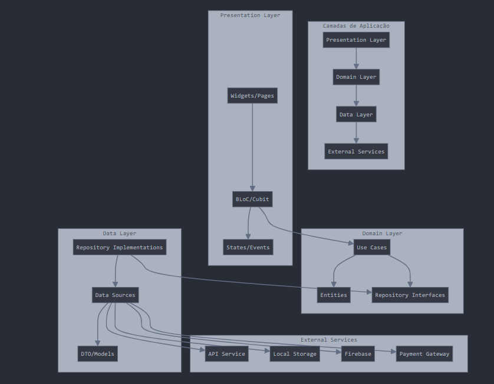
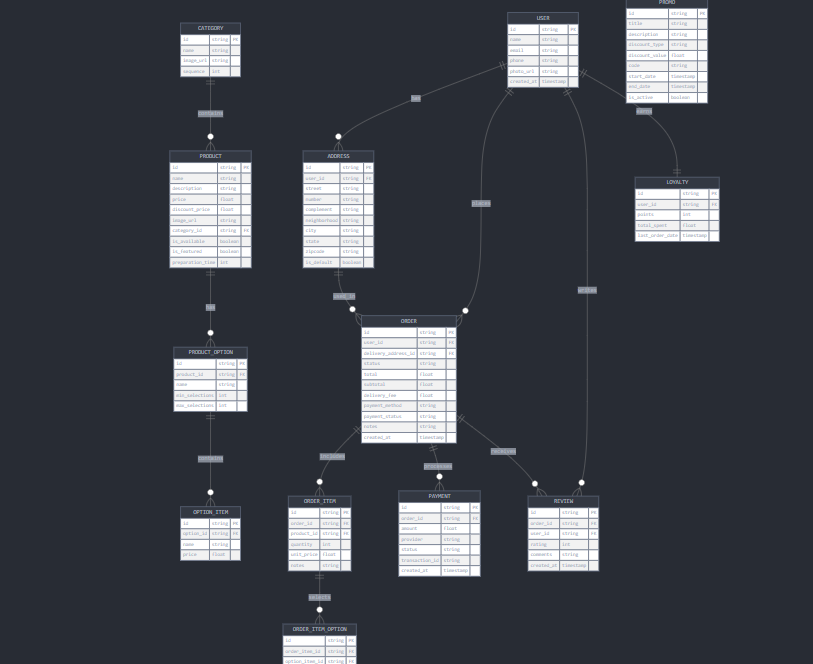

Aplicativo Dedicado para Restaurante com Flutter
1. Requisitos Funcionais Revisados
Para Clientes

Cadastro e autenticação
Perfil com dados pessoais e endereços
Visualização do cardápio completo do restaurante
Personalização de pedidos (adicionar/remover ingredientes)
Carrinho de compras
Métodos de pagamento (cartão, Pix, pagamento na entrega)
Rastreamento de pedido
Histórico de pedidos e reordenação rápida
Sistema de avaliação
Programa de fidelidade/pontos
Notificações de promoções e ofertas
Reserva de mesa (opcional)

Para Restaurante (Administrativo)

Gestão de cardápio (adicionar, editar, remover itens)
Configuração de disponibilidade de produtos
Recebimento e processamento de pedidos
Gestão de status do pedido
Configuração de área de entrega e taxas
Relatórios de vendas
Gerenciamento de promoções
Comunicação com clientes

2. Arquitetura para Aplicativo Flutter
Para um aplicativo dedicado a um único restaurante, podemos usar uma arquitetura mais simplificada e coesa:
Arquitetura de Alto Nível

+------------------+        +------------------+
|                  |        |                  |
|  App Cliente     |        |  App Admin       |
|  (Flutter)       |        |  (Flutter)       |
|                  |        |                  |
+--------+---------+        +--------+---------+
         |                           |
         |                           |
+--------v---------------------------v---------+
|                                              |
|            API Backend (REST)                |
|                                              |
+----------------------+---------------------+-+
         |                    |              |
+--------v---------+ +---------v--------+  +-v--------------+
|                  | |                  |  |                |
|  Banco de Dados  | |  Armazenamento   |  |  Serviços      |
|  (PostgreSQL)    | |  (Firebase/S3)   |  |  Externos      |
|                  | |                  |  |                |
+------------------+ +------------------+  +----------------+

Padrão de Arquitetura para Flutter
Recomendo o padrão Clean Architecture com BLoC (Business Logic Component) 
para o Flutter:

3. Stack Tecnológica Recomendada
Frontend (App Cliente e Admin)

Framework: Flutter
Gerenciamento de Estado: BLoC ou Riverpod
Injeção de Dependência: GetIt
UI Components: Material Design ou biblioteca personalizada
Navegação: AutoRoute ou Go Router
Cache Local: Hive ou SharedPreferences
HTTP Client: Dio ou http

Backend

Linguagem: Dart (com shelf ou aqueduct) para manter consistência

Alternativas: Node.js/Express ou Firebase Functions

Banco de Dados:

PostgreSQL ou MySQL para dados relacionais
Firebase Firestore (opção mais simples para começar)

Autenticação: Firebase Auth ou JWT customizado
Storage: Firebase Storage (para imagens de produtos)
Cloud: Firebase ou servidor VPS (Digital Ocean, AWS)
Notificações: Firebase Cloud Messaging

DevOps

CI/CD: GitHub Actions, Codemagic ou Bitrise (específicos para Flutter)
Monitoramento: Firebase Crashlytics
Analytics: Firebase Analytics

4. Estrutura de Projeto Flutter
lib/
├── app/
│   ├── app.dart
│   └── theme/
├── config/
│   ├── routes.dart
│   └── constants.dart
├── core/
│   ├── errors/
│   ├── network/
│   └── utils/
├── data/
│   ├── datasources/
│   │   ├── local/
│   │   └── remote/
│   ├── models/
│   └── repositories/
├── domain/
│   ├── entities/
│   ├── repositories/
│   └── usecases/
├── presentation/
│   ├── bloc/
│   ├── pages/
│   │   ├── auth/
│   │   ├── cart/
│   │   ├── home/
│   │   ├── menu/
│   │   ├── orders/
│   │   └── profile/
│   └── widgets/
└── main.dart

5. Modelo de Dados Simplificado

6. Fluxos Principais do Aplicativo
App Cliente

Cadastro/Login

Cadastro com email/senha ou Google/Facebook
Verificação por SMS (opcional)

Navegação pelo Cardápio

Categorias
Produtos em destaque
Busca
Filtros (vegetariano, vegano, etc.)

Detalhes do Produto

Fotos, descrição, preço
Personalização (adicionar/remover ingredientes)
Adicionar ao carrinho

Carrinho

Revisão de itens
Aplicação de cupons
Seleção de endereço
Escolha de método de pagamento

Acompanhamento de Pedido

Status em tempo real
Tempo estimado
Notificações de atualização

Perfil e Histórico

Dados pessoais
Pedidos anteriores
Programa de fidelidade

App Admin

Dashboard

Pedidos ativos
Vendas do dia
Status do restaurante

Gestão de Pedidos

Aceitar/rejeitar
Atualizar status
Histórico

Gestão de Cardápio

Adicionar/editar produtos
Gerenciar categorias
Definir disponibilidade

Promoções

Criar ofertas
Gerar cupons
Definir produtos em destaque

7. Estratégia de Implementação
Fase 1: MVP (2-3 meses)

Aplicativo cliente com funcionalidades básicas

Cadastro/login
Visualização do cardápio
Carrinho e checkout
Pagamento (método básico)
Histórico de pedidos

Painel admin web essencial

Gestão de pedidos
Gestão básica de cardápio

Fase 2: Refinamento (1-2 meses)

Melhorias de UX baseadas em feedback
Opções de personalização de pedidos
Avaliações de pedidos
Cupons e promoções
Notificações push

Fase 3: Recursos Avançados (2 meses)

Programa de fidelidade
Pedidos agendados
Recomendações personalizadas
Integração com sistema de PDV (se necessário)
Analytics avançado

8. Considerações Técnicas
Backend Flutter
Para manter tudo em Flutter, você pode:

Usar Dart Shelf para criar uma API REST
Implementar usando Aqueduct, um framework para servidor Dart
Ou usar Firebase como backend completo (mais rápido de implementar)

Performance e Offline

Implementar cache local para cardápio
Permitir visualização offline do cardápio
Sincronização quando voltar online

Design Responsivo

Design adaptável para diferentes tamanhos de tela
Implementação para smartphones e tablets
Versão web para acesso pelo navegador

9. Vantagens Desta Abordagem

Código único: Flutter para todos os clientes (iOS, Android, web)
Consistência visual: Mesma experiência em todas as plataformas
Controle total: Personalização completa da experiência do usuário
Fidelização: Crie um canal direto com seus clientes
Economia: Desenvolvimento mais rápido e eficiente com Flutter
Escalabilidade: Comece simples e expanda conforme o negócio cresce